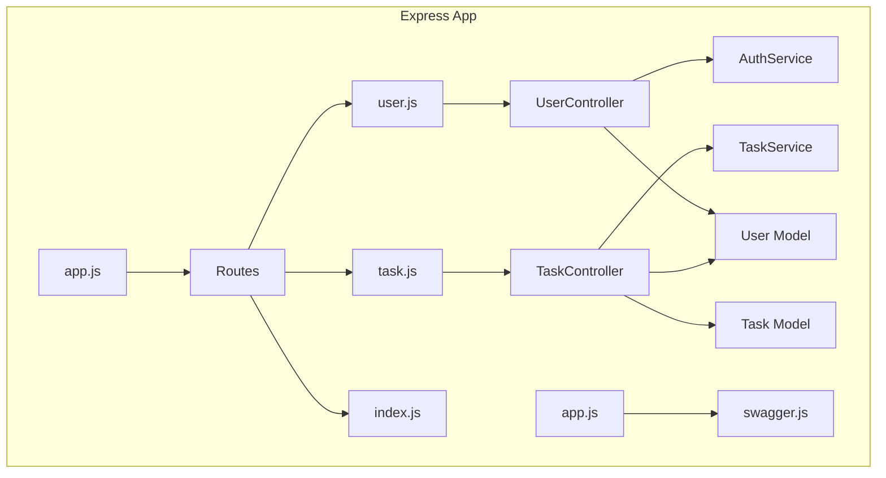

# Task Management Backend (`task_management_backend`)

## Project Overview

This is the backend server for **TaskFlow**, a simple, scalable task management application. The backend is a Node.js Express server providing a RESTful API for user authentication, task CRUD (Create, Read, Update, Delete) operations, filtering, and business logic. Data is stored persistently in an SQLite database via Sequelize ORM. API documentation is rich and interactive, built automatically from source and available via Swagger/OpenAPI.

- **Platform:** Node.js + Express
- **APIs:** RESTful JSON endpoints, JWT authentication
- **Database:** SQLite (can be swapped for another with configuration)

## Features

- User registration, login, logout and JWT auth
- Task creation, editing, deletion (ownership enforced)
- Task filtering, sorting, searching (by status, priority, due date, text, etc.)
- Pagination for task listings
- Profile endpoint for authenticated users
- Robust input validation and error responses
- Automatically synchronized database schema
- Rich, interactive API docs at `/docs`
- Clean, modular code structure (controllers, services, models, middleware)

## Installation and Setup

### 1. Prerequisites

- Node.js v16+ recommended
- `npm` package manager
- No database installation required (uses file-based SQLite by default)

### 2. Install dependencies

```bash
cd task_management_backend
npm install
```

### 3. Environment Variables

Create a `.env` file in the `task_management_backend` directory to override defaults. Example:

```
PORT=3000                # Port to run API server (default: 3000)
HOST=0.0.0.0             # Bind address
JWT_SECRET=your_jwt_secret_key
NODE_ENV=development
```

> The default DB is a file `data.sqlite` created in the root folder.

### 4. Database

No manual setup required. The SQLite database file will be created and models synchronized automatically. To reset DB, delete the `data.sqlite` file.

### 5. Running the Application

#### Development (with auto-reload):

```bash
npm run dev
```

#### Production

```bash
npm start
```

By default, the server is available at [http://localhost:3000](http://localhost:3000).

## API Usage

- Base URL: `/`
- All routes requiring authentication use Bearer JWT in `Authorization` header.

### OpenAPI & Swagger Docs

- **Interactive API:** [http://localhost:3000/docs](http://localhost:3000/docs)
- **Full API Spec:** [api_spec.md](./api_spec.md)
- **Swagger Source Code:** [`swagger.js`](./swagger.js)

### Main Endpoints

#### User Auth
- `POST   /api/auth/register` — Register user
- `POST   /api/auth/login` — Login, get JWT
- `POST   /api/auth/logout` — Logout (stateless)
- `GET    /api/users/profile` — Authenticated user's profile

#### Tasks
- `POST   /api/tasks` — Create task
- `GET    /api/tasks` — List tasks (filter/sort/page/search)
- `GET    /api/tasks/:id` — Get task by ID
- `PUT    /api/tasks/:id` — Update task
- `DELETE /api/tasks/:id` — Delete task

See the [api_spec.md](./api_spec.md) for input/output schemas, parameters, error formats, and more.

#### Example API Usage

- Register a new user:
  ```http
  POST /api/auth/register
  Content-Type: application/json

  { "username": "alice", "email": "alice@email.com", "password": "secret!" }
  ```
- Authenticate to obtain JWT, then use JWT as:
  ```
  Authorization: Bearer <jwt-token>
  ```

## Development Structure & Architecture

### Directory Structure

```
task_management_backend/
├── api_spec.md
├── package.json
├── .env.example
├── data.sqlite
├── src/
│   ├── app.js         # Express app, middleware, Swagger
│   ├── server.js      # Entrypoint/startup
│   ├── routes/
│   │   ├── index.js   # Mounts all API routes
│   │   ├── user.js    # User auth/profile API routes
│   │   ├── task.js    # Task API routes
│   ├── controllers/   # Express route handlers
│   │   ├── user.js
│   │   ├── task.js
│   │   └── health.js
│   ├── services/      # Business logic
│   │   ├── auth.js
│   │   ├── task.js
│   │   └── health.js
│   ├── models/        # Sequelize models
│   │   ├── user.js
│   │   ├── task.js
│   │   └── index.js
│   └── middleware/
│       └── auth.js    # Auth/JWT middleware
├── swagger.js         # OpenAPI config/spec
├── nodemon.json       # Dev reload config
└── README.md
```

### Architectural Notes

- **Models**: Sequelize ORM models for `User` and `Task` with associations.
- **Controllers**: Thin route handlers, delegate to services.
- **Services**: Core business logic, DB access, input validation.
- **Middleware**: For JWT authentication and error handling.
- **Routes**: Grouped by feature (auth, tasks), mounted under `/api`.
- **Docs**: Swagger UI and machine-generated OpenAPI v3 JSON at `/docs`.

#### Relationships
- Each user can own multiple tasks (`User hasMany Tasks`)
- Tasks are owned by users (`Task belongsTo User`)
- API errors are consistent, JSON-formatted.

### Quick Architecture Diagram



## Environment Variable Reference

| Name         | Default                      | Required | Purpose                |
|--------------|------------------------------|----------|------------------------|
| PORT         | 3000                         | No       | API server port        |
| HOST         | 0.0.0.0                      | No       | Bind address           |
| JWT_SECRET   | `default_jwt_secret_change_this` | Strongly RECOMMENDED | JWT signing secret     |
| NODE_ENV     | development                  | No       | Environment flag       |

## Contact & Maintenance

- **Maintainer:** Project development handoff, see [CONTRIBUTING.md] (if present) for guidelines.
- **Issue tracker:** Use your version control/project management platform.
- Code is modular and documented for ease of onboarding/updating.

---
**For details on endpoint schemas and error codes, see [`api_spec.md`](./api_spec.md) and [Swagger UI](http://localhost:3000/docs).**
